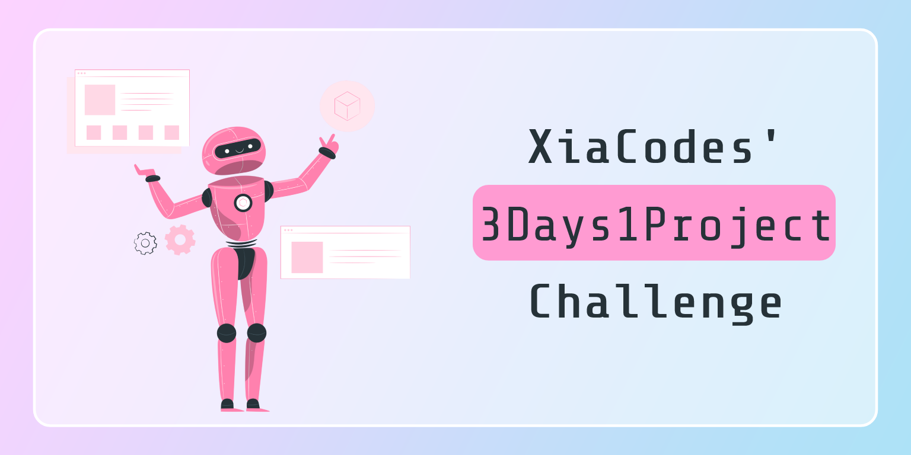

   

 

  This repository showcases a collection of projects that I have developed within a three-day timeframe. Each project will show my creativity and problem-solving skills while working under constraints.

  The projects are in various programming languages, with a focus on JavaScript at the moment. You can find more details about my progress and thoughts on each project by visiting <a href="https://xiacodes.tumblr.com/tagged/3days1project" target="_blank">my blog</a>.

--------

<h3>Why am I doing this challenge?</h3>
<ol>
  <li><b>Fighting boredom:</b> You know those days when you're feeling super bored? Well, this challenge started on one of those days. I wanted to make sure I put my time and energy into something productive and creative! 🎨</li>  
  <li><b>Testing creativity and problem-solving skills:</b>  The challenge is all about putting my creativity and problem-solving skills to the test. I have just three days to come up with awesome ideas and find innovative solutions to problems! 🛠️</li>  
  <li><b>Fast-paced learning:</b> This challenge is all about learning new things at lightning speed. The time limits really push me to learn and implement new concepts quickly. I get to explore new territory and dive deeper into the programming languages and technologies I will be using. It's like a fast-paced learning adventure! 🚀</li>
</ol>

--------

<h3>Projects</h3>

  To view the projects and more information on them, visit the website I created for this challenge: <a href="https://xiacodes-3days1project.neocities.org/" target="_blank">link</a> 💻

Thank you for exploring my <a href="https://xiacodes.tumblr.com/tagged/3days1project" target="_blank">#3Days1Project Challenge</a>! Feel free to browse through the projects and witness the creative solutions I developed within a limited timeframe.

--------
